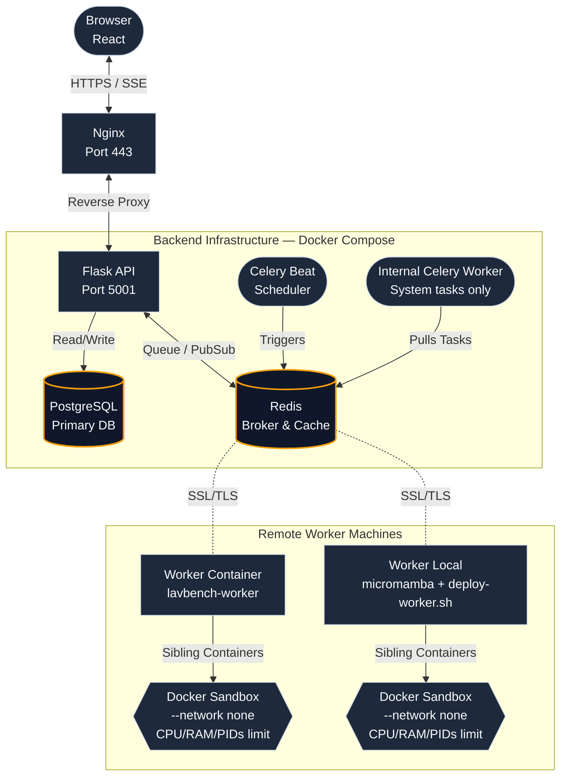

# LavBench

<div align="center">
  <picture>
    <source media="(prefers-color-scheme: dark)" srcset="docs/source/_static/brand_logo_dark.svg">
    <source media="(prefers-color-scheme: light)" srcset="docs/source/_static/brand_logo.svg">
    
  </picture>
</div>

<p align="center">
  <a href="LICENSE"></a>
  <a href="https://github.com/delyan-boychev/lavbench/actions/workflows/ci.yml"></a>
</p>

**LavBench** derives its name from the "Lav" (Lion), a proud national symbol of Bulgaria.

It is a secure, sandboxed machine learning competition platform. Participants submit Jupyter notebooks or raw Python code which are executed in isolated Docker containers under strict resource constraints. Real-time leaderboards stream via SSE, with double-blind review for anonymous jury scoring.

Created by the Bulgarian AI Olympiad Committee for IOAI selection and national competitions. Other countries AI olympiad committees, teams and IOAI board and others are welcome to use and contribute.

## Features

- **Sandboxed Execution:** User code runs in hardened Docker containers with `--network none`, `--cap-drop ALL`, `--read-only` rootfs, `--security-opt no-new-privileges`, CPU/RAM/process limits, and `tmpfs` mounts.
- **Double-Blind Review:** Competitor demographics are encrypted at rest (Fernet) and only revealed after scores are finalized.
- **Live Leaderboards:** Server-Sent Events push real-time score updates to all connected clients.
- **Multi-Stage Competitions:** Support for stages with independent deadlines, grace periods, and score visibility controls.
- **Custom Evaluators:** Jury members can upload Python evaluation scripts with per-metric weighting and configuration.
- **GPU/CPU Routing:** Celery queue routing intelligently separates GPU and CPU workloads across different worker pools.
- **Automated Backups:** Database and uploaded files are backed up every 20 minutes during active competitions (every 6 hours when idle).
- **Audit Logs:** Full logging of administrative actions (e.g. creating/deleting challenges, resetting passwords, editing scores) with detailed metadata payloads and justification tracking.
- **i18n Support:** Available in English and Bulgarian (contributions for additional languages are welcome).
- **Strict Security:** Includes httpOnly cookie auth, token revocation with a Redis blacklist, rate limiting, encrypted PII, and ProxyFix for trusted reverse proxies.
- **Typed API & Validation:** OpenAPI 3.0 spec with auto-generated TypeScript type declarations and JSDoc `@type` annotations on all frontend API calls. `tsc --noEmit` verifies all JSDoc annotations and component props.

---

## Quick Start

```bash
# 1. One-command server setup (creates env, generates keys, installs deps)
make setup-server

# 2. Launch locally
make dev

# 3. Open
# Frontend -> http://localhost:5173
# API      -> http://localhost:5001/api
```

Press `Ctrl+C` to stop all services.

See the [Admin Guide](guides/en/admin_guide.md) for setup prerequisites, TLS/HTTPS, Docker deployment, remote workers, and configuration editing.

---

## Architecture



### Components

| Service                  | Role                                                                                             | Port   |
| ------------------------ | ------------------------------------------------------------------------------------------------ | ------ |
| **PostgreSQL**           | Primary database for users, challenges, tasks, and submissions                                   | `5432` |
| **Redis**                | Celery message broker, SSE pub/sub, caching, and rate limiting                                   | `6379` |
| **Flask API**            | REST API and SSE streaming endpoints                                                             | `5001` |
| **Celery Beat**          | Handles periodic tasks like the submission watchdog and automated backups                        | —      |
| **Celery Worker (int.)** | Built-in system task worker (backups, watchdog, leaderboard recalc) — runs inside Docker Compose  | —      |
| **Celery Worker (ext.)** | Evaluation worker — runs in Docker container or directly on remote machines, sibling containers  | —      |
| **Nginx/React**          | Static file serving and API reverse proxy (HTTPS)                                                | `443`  |

---

## Project Structure

```text
lavbench/
├── backend/
│   ├── app.py                   # Flask application factory
│   ├── config.py                # Config class reads all env vars
│   ├── models/                  # SQLAlchemy models
│   ├── auth_utils.py            # JWT auth, rate limiting, token revocation
│   ├── cache_utils.py           # Redis caching, connection pool, locks
│   ├── error_utils.py           # err() helper + DEFAULT_ERROR_MESSAGES (128 error codes)
│   ├── evaluation_engine.py     # Parquet-based evaluation with 70+ metrics across 12 categories
│   ├── sse_utils.py             # SSE pub/sub helpers
│   ├── worker_utils.py          # Worker runtime (Docker commands, status reporting)
│   ├── tasks.py                 # Celery task definitions + beat schedule
│   ├── Dockerfile               # Backend container (Flask + Celery)
│   ├── Dockerfile.worker        # Minimal worker-only container (~100 MB)
│   ├── setup-admin.py            # Creates admin user account + admin_credentials.txt
│   ├── scripts/                 # Lint/CI scripts (check_error_codes.py)
│   ├── utils/                  # Utility modules (access, audit, cache, dates, files, etc.)
│   ├── routes/                  # Flask blueprints (admin, auth, challenges, etc.)
│   ├── services/                # Business logic
│   ├── task_modules/            # Submission runner, templates, system tasks
│   └── tests/                   # Backend tests (pytest, 946 tests, 75% coverage)
├── frontend/
│   ├── src/
│   │   ├── components/          # Reusable components (admin, challenge, ui, layout)
│   │   ├── pages/               # Page components
│   │   ├── services/            # ApiService, AuthContext, AppContext
│   │   ├── context/             # React context providers
│   │   ├── hooks/               # Custom hooks
│   │   └── types/               # Auto-generated TypeScript declarations (api.d.ts)
│   ├── scripts/
│   │   └── check_translations.py # Validates i18n keys
│   ├── public/locales/          # i18n (en, bg)
│   ├── tsconfig.json            # TypeScript config for JSDoc type checking
│   └── nginx.conf               # Nginx configuration
├── guides/                      # User documentation (competitor, jury, admin, API)
├── docs/                        # Project documentation (Sphinx, architecture)
├── scripts/
│   ├── setup.sh                 # Server setup (prereqs, micromamba, npm, keys)
│   ├── setup-worker.sh          # Worker setup (prereqs, env, interactive config)
│   ├── generate-keys.sh         # Interactive key/cert generator (.env + worker.env)
│   ├── edit-config.sh           # Menu-based config editor (server + worker)
│   ├── deploy-docker.sh         # Docker Compose deployment
│   ├── deploy-worker.sh         # Worker deploy (build + start from saved config)
│   └── deploy-debug.sh          # Local debug mode (micromamba + Flask + Celery)
├── docker-compose.yml           # Docker Compose (db, redis, backend, beat, frontend)
├── Makefile                     # Top-level targets (setup, worker, edit, deploy-docker, docs)
├── .env.example                 # Environment template
├── LICENSE                      # AGPL v3
└── NOTICE                       # Copyright notice
```

---

## Configuration

Copy and edit the environment file:

```bash
cp .env.example .env
```

### Required

| Variable | Description | Default |
|---|---|---|
| `SECRET_KEY` | Flask secret for JWT signing | **Required** |
| `DATABASE_URL` | PostgreSQL connection string | **Required** |
| `ENCRYPTION_KEY` | Fernet key for PII encryption at rest | **Required** |

### Celery / Redis Broker

| Variable | Description | Default |
|---|---|---|
| `CELERY_BROKER_URL` | Redis broker URL for Celery | `redis://localhost:6379/0` |
| `CELERY_RESULT_BACKEND` | Redis result backend URL | `redis://localhost:6379/0` |
| `CELERY_RESULT_EXPIRES` | Task result TTL (seconds) | `3600` |
| `CELERY_BROKER_SOCKET_TIMEOUT` | Broker socket timeout (seconds) | `10` |
| `CELERY_BROKER_SOCKET_CONNECT_TIMEOUT` | Broker connect timeout (seconds) | `3` |
| `CELERY_WORKER_CONCURRENCY` | Max concurrent worker processes | `2` |

### Redis Client

| Variable | Description | Default |
|---|---|---|
| `REDIS_SOCKET_CONNECT_TIMEOUT` | Client connect timeout (seconds) | `5` |
| `REDIS_SOCKET_TIMEOUT` | Client socket timeout (seconds) | `5` |

### Redis SSL/TLS

| Variable | Description | Default |
|---|---|---|
| `REDIS_SSL_CA_CERTS` | CA certificate path (container path) | — |
| `REDIS_SSL_CERTFILE` | Client certificate path | — |
| `REDIS_SSL_KEYFILE` | Client key path | — |
| `REDIS_SSL_CERT_REQS` | Certificate verification level | `required` |

### Server Addresses

| Variable | Description | Default |
|---|---|---|
| `MAIN_SERVER_URL` | Server URL for worker callbacks | `http://localhost:5001` |
| `API_BASE` | API base URL | `http://localhost:5001/api` |
| `CORS_ORIGINS` | Allowed CORS origins (comma-separated) | `*` |

### Worker Identity & Mode

| Variable | Description | Default |
|---|---|---|
| `WORKER_PUBLIC_KEY` | Ed25519 public key (server-side) | **Required for workers** |
| `WORKER_PRIVATE_KEY` | Ed25519 private key (worker-side) | **Required for workers** |
| `WORKER_GPU_ID` | GPU device(s) for GPU workers | `""` (all) |
| `RUNNING_AS_WORKER` | Whether process is a Celery worker | `false` |
| `INTERNAL_ONLY_WORKER` | Restrict to system tasks only | `false` |
| `EVALUATION_ONLY_WORKER` | Restrict to evaluation tasks only | `false` |

### Worker Sandbox Resources

| Variable | Description | Default |
|---|---|---|
| `GPU_RAM_PER_TASK_GB` | RAM per GPU evaluation container (GB) | `8` |
| `CPU_RAM_PER_TASK_GB` | RAM per CPU evaluation container (GB) | `8` |
| `RESERVED_RAM_GB` | RAM reserved for OS/Docker overhead (GB) | `4` |
| `RESERVED_CPU_CORES` | CPU cores reserved for system | `1` |
| `RAM_CLAMP_FACTOR` | Max overshoot ratio before rejecting task | `1.05` (5%) |

### Worker HTTP Client

| Variable | Description | Default |
|---|---|---|
| `WORKER_MAX_LOG_LINES` | Max log lines in status reports | `10000` |
| `WORKER_REPORT_MAX_RETRIES` | Max retries for status reports | `3` |
| `WORKER_REPORT_TIMEOUT` | Status report timeout (seconds) | `10` |
| `WORKER_DOWNLOAD_TIMEOUT` | Submission download timeout (seconds) | `30` |

### Server-Sent Events (SSE)

| Variable | Description | Default |
|---|---|---|
| `SSE_MAX_PER_USER` | Max concurrent SSE connections per user | `5` |
| `SSE_MAX_GLOBAL` | Max total SSE connections | `50` |
| `SSE_IDLE_TIMEOUT` | SSE idle timeout (seconds) | `1800` (30 min) |
| `SSE_LOG_TTL` | Log entry TTL (seconds) | `86400` (24 h) |
| `SSE_LOG_MAX_LINES` | Max log lines kept per submission | `10000` |

### Admin Tools

| Variable | Description | Default |
|---|---|---|
| `USER_SEARCH_LIMIT` | Max user search results | `500` |
| `AUDIT_LOG_YIELD_PER` | Batch size for audit log streaming | `500` |

### Backup

| Variable | Description | Default |
|---|---|---|
| `BACKUPS_DIR` | Backup file storage directory | `/backups` |
| `MIN_BACKUP_DISK_GB` | Minimum free disk space for backup (GB) | `1` |
| `BACKUP_TIMEOUT` | Backup subprocess timeout (seconds) | `600` |

### Image Builder (Docker)

| Variable | Description | Default |
|---|---|---|
| `TASK_IMAGES_DIR` | Task base-image storage directory | `./backend/task_images` |
| `MIN_BUILD_DISK_GB` | Minimum free disk space for image builds (GB) | `5` |
| `BUILD_LOCK_EXPIRY` | Build lock expiry (seconds) | `3600` |

### Logging

| Variable | Description | Default |
|---|---|---|
| `LOG_DIR` | Directory for application logs (rotated daily, kept 6 days) | `/app/logs` |
| `WORKER_LOG_SHIP_URL` | URL for remote workers to POST gzipped log batches | — (disabled) |

### Gunicorn (Server)

| Variable | Description | Default |
|---|---|---|
| `GUNICORN_MAX_REQUESTS` | Max requests per worker before restart (prevents memory leaks) | `10000` |
| `GUNICORN_MAX_REQUESTS_JITTER` | Random jitter added to max_requests (prevents thundering herd) | `2000` |
| `GUNICORN_ULIMIT_NOFILE` | File descriptor limit for high concurrency (300+ users) | `65536` |
| `GUNICORN_ACCESS_LOGFILE` | Gunicorn access log path | `/app/logs/gunicorn_access.log` |
| `GUNICORN_ERROR_LOGFILE` | Gunicorn error log path | `/app/logs/gunicorn_error.log` |

### Application Defaults

| Variable | Description | Default |
|---|---|---|
| `UPLOAD_FOLDER` | Upload storage path | `./backend/uploads` |
| `HF_CACHE_DIR` | HuggingFace dataset cache directory | `./backend/hf_cache` |
| `LAVBENCH_WORKSPACE_DIR` | Workspace root for evaluation sandboxes | `./backend/workspace` |
| `FLASK_DEBUG` | Enable Flask debug mode | `false` |
| `DEADLINE_GRACE_PERIOD_SECONDS` | Grace period after challenge deadline (seconds) | `60` |
| `DEFAULT_PER_PAGE` | Default items per page (pagination) | `10` |
| `MAX_PER_PAGE` | Max items per page | `100` |
| `CACHE_TIMEOUT` | Redis cache TTL (seconds) | `300` |
| `DEFAULT_TIME_LIMIT_SEC` | Default task time limit (seconds) | `300` |
| `DEFAULT_RAM_LIMIT_MB` | Default task RAM limit (MB) | `8192` |
| `DEFAULT_PUBLIC_EVAL_PERCENTAGE` | Default public evaluation split (%) | `30` |

### Infrastructure (scripts / docker-compose only)

These are consumed by deployment scripts and `docker-compose.yml`, not by the Python `Config` class directly.

| Variable | Description | Default / Source |
|---|---|---|
| `POSTGRES_PASSWORD` | PostgreSQL password | Set by `make setup` |
| `REDIS_PASSWORD` | Redis auth password | Set by `make setup` |
| `REDIS_PROTO` | Redis protocol (`redis` / `rediss`) | Set by `make setup` |
| `REDIS_BIND` | Redis bind address | `0.0.0.0` |
| `SERVER_ADDRESS` | Server hostname for URL templates | Set by `make setup` |
| `WORKER_MODE` | Worker run mode (`docker` / `local`) | In `worker.env` |
| `WORKER_TYPE` | Worker role (`eval` / `internal` / `both`) | In `worker.env` |
| `GPU_CORES_PER_TASK` | CPU cores per GPU evaluation container | In `worker.env` |
| `CPU_CORES_PER_TASK` | CPU cores per CPU evaluation container | In `worker.env` |

---

## Testing

### Backend Testing

```bash
cd backend
micromamba run -n lavbench_backend python -m pytest -n auto tests/ -v
```

Includes 946 tests covering routes, auth, evaluation (all 44 metric paths), caching, rate limiting, models, submission runner, and evaluation engine edge cases.

### Sphinx Documentation

```bash
cd docs
pip install -r requirements.txt
make html        # generates build/ (open docs/build/index.html)
make clean       # removes build/
```

The Sphinx build runs automatically in CI (`.github/workflows/ci.yml`) and deploys to [Read the Docs](https://lavbench.readthedocs.io/) on push to `main`.

### Frontend Testing

```bash
cd frontend

# Unit / component tests (vitest — 527 tests)
npm run test

# Type checking (JSDoc annotations + component props)
npm run check-types

# Error code & translation parity check
python ../backend/scripts/check_error_codes.py

# Build Sphinx documentation
pip install -r docs/requirements.txt
cd docs && make html
```

---

## Security Highlights

| Layer                | Mechanism                                                                                                                                                                                                  |
| -------------------- | ---------------------------------------------------------------------------------------------------------------------------------------------------------------------------------------------------------- |
| **Authentication**   | httpOnly cookies with JWTs (XSS-immune), 24h expiry.                                                                                                                                                       |
| **Authorization**    | Role-based (admin, jury, competitor) with DB-backed role lookup.                                                                                                                                           |
| **Token Revocation** | Redis blacklist using `jti` — logging out instantly invalidates tokens.                                                                                                                                    |
| **Rate Limiting**    | Lua atomic counters per-user and per-endpoint; fails open if Redis is down.                                                                                                                                |
| **PII Encryption**   | Fernet symmetric encryption secures competitor demographics at rest.                                                                                                                                       |
| **Sandbox**          | Hardened container: `--network none`, `--cap-drop ALL`, `--read-only` rootfs, `--security-opt no-new-privileges`, `--cpus <CPU_CORES_PER_TASK or GPU_CORES_PER_TASK>`, `--pids-limit 64`, `--tmpfs /tmp`, `--memory-swap` disabled, and RAM limits. Cores per task are configured per-worker via `CPU_CORES_PER_TASK` / `GPU_CORES_PER_TASK`. |
| **Ground Truth**     | `labels.parquet` is strictly evaluated server-side and never mounted into the user's evaluation sandbox.                                                                                                   |
| **IP Trust**         | `ProxyFix` middleware ensures only the `X-Forwarded-For` headers from Nginx are trusted.                                                                                                                   |
| **HF API Keys**      | Fetched dynamically on-demand by workers via authenticated API routes, never stored in Redis.                                                                                                              |

---

## Documentation

| Guide                                                       | Target Audience | Focus Areas                                                                        |
| ----------------------------------------------------------- | --------------- | ---------------------------------------------------------------------------------- |
| [Competitor Guide](guides/en/competitor_guide.md)                 | Competitors     | Logging in, understanding tasks, submitting notebooks, leaderboard navigation.     |
| [Jury Guide](guides/en/jury_guide.md)                       | Jury Members    | Monitoring submissions, manual scoring, competitor registration, exports.          |
| [Admin Guide](guides/en/admin_guide.md)                     | Administrators  | Full setup, TLS/HTTPS, worker deployment, challenge/task management, backups.      |
| [API Reference](http://localhost:5001/apidoc/swagger/)    | Developers      | Interactive Swagger UI detailing all 72 backend endpoints.                         |
| [Error Code Linter](backend/scripts/check_error_codes.py) | Developers      | Validates `err()` usage and `api.ERR_*` translation parity across EN/BG.           |
| [Sphinx Documentation](https://lavbench.readthedocs.io/)    | Developers      | Full auto-generated API reference (autodoc) and rendered OpenAPI spec.             |

---

## Contributing

See [CONTRIBUTING.md](CONTRIBUTING.md) for the full pull request checklist, setup guide, code conventions, and type system overview.

---

## License

Released under the [GNU Affero General Public License v3.0](LICENSE).
