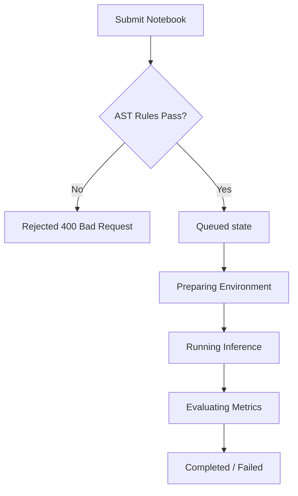

# Student (Competitor) Complete Guide

Welcome to the NAI Competition & Sandbox Platform. This document provides a complete guide for students (competitors) participating in machine learning, NLP, and algorithm design challenges.

---

## 1. Authentication & Session Lifetimes

To access the platform, you must possess active credentials provided by your competition administrator.
1. Navigate to the login page (`/login`).
2. Input your username or email address and password.
3. The platform validates credentials and issues a JSON Web Token (JWT) signature.
4. Your token is valid for exactly **24 hours**. After expiration, you must log back in to renew your token session.

> [!NOTE]
> Competitors are bound to their registered challenge. Attempting to retrieve, inspect, or submit to other active challenges will trigger a `403 Forbidden` access restriction.

---

## 2. Notebook Submission Workflow

Competitors develop their models locally in Jupyter notebooks (`.ipynb`). Instead of submitting the entire notebook containing large scratch outputs, the platform lets you select and run only the essential cells.

### Step 1: Browse Active Tasks
Select your challenge from the dashboard. Each challenge contains one or more tasks. Check the task's properties:
* **RAM Limit:** Maximum memory allowed inside the execution container (e.g., `8192 MB`).
* **Time Limit:** Maximum runtime permitted for your code (e.g., `300 seconds`).
* **GPU Node Required:** Indicates if your code runs on a GPU acceleration node.

### Step 2: Upload and Parse Notebook
1. Inside the task detail page, click **Upload Notebook**.
2. Upload your `.ipynb` file.
3. The platform parses the notebook JSON structure and splits it into individual code blocks, retaining line breaks and syntax indentation.

### Step 3: Select Concatenation Cells
Select only the code cells required to run your submission. Selected cells are combined in order using a single line break (`\n`) to generate a Python execution script (`submission_runner.py`).

### Step 4: Write the `predict` Entry Point
Your selected cells must define a function named `predict(inputs_list)`. The sandbox runner calls this function to score your submission.

#### Code Example A: Text Dictionary-Based Heuristic
```python
# SUBMIT
def predict(inputs_list):
    """
    Classifies IMDb movie reviews using a simple dictionary lexicon.
    inputs_list: list of strings (movie review text)
    returns: list of integers (1 for positive sentiment, 0 for negative)
    """
    pos_words = {'good', 'great', 'love', 'amazing', 'excellent', 'wonderful', 'perfect'}
    neg_words = {'bad', 'worst', 'hate', 'boring', 'waste', 'terrible', 'awful'}
    
    predictions = []
    for text in inputs_list:
        words = set(text.lower().split())
        score = len(words.intersection(pos_words)) - len(words.intersection(neg_words))
        predictions.append(1 if score >= 0 else 0)
    return predictions
```

#### Code Example B: Scikit-Learn TF-IDF Classifier
```python
# SUBMIT
import joblib
from sklearn.feature_extraction.text import TfidfVectorizer

# Load vectorizer and pre-trained classification model
# Resource files are mounted in the container working directory
vectorizer = joblib.load("tfidf_vectorizer.pkl")
model = joblib.load("logistic_regression_model.pkl")

def predict(inputs_list):
    """
    Converts text inputs using TF-IDF and predicts sentiment labels.
    """
    features = vectorizer.transform(inputs_list)
    predictions = model.predict(features)
    return list(predictions)
```

---

## 3. Pre-Execution AST Rule Engine

To safeguard the shared cluster execution nodes from resource attacks, submissions undergo automated static analysis before they are allowed into the celery queue:

### Banned Imports
Your code must not import system-level libraries. The engine uses Python's Abstract Syntax Tree (`ast`) module to scan imports.
* **Banned Modules:** `os`, `sys`, `subprocess`, `requests`, `urllib`, `socket`, `shutil`, `builtins`, `pty`, `multiprocessing`.
* **Violating Code:**
  ```python
  import os  # REJECTED!
  from subprocess import Popen  # REJECTED!
  ```

### Magic Commands
Any cell line starting with `!` or `%` (standard Jupyter helper commands) is blocked.
* **Violating Code:**
  ```python
  !pip install pandas  # REJECTED!
  %matplotlib inline  # REJECTED!
  ```

### Required Tag
If the task requires tag verification, the string `# SUBMIT` must appear somewhere in your selected code blocks.
* **Valid Code:**
  ```python
  # SUBMIT
  def predict(inputs):
      return [0] * len(inputs)
  ```

---

## 4. Live Queue Tracking & Priority Routing

Once validation passes, the submission is written to the database with state `queued`. 



### Queue Priority Levels
Submissions are assigned processing priorities (1 to 9, where 9 is highest) to ensure fair queuing:
* **Jury / Admin submissions:** Priority `9` (instant processing).
* **First submission of the day:** Priority `6`.
* **Subsequent submissions:** Decreases down to `1` based on your submission count today.

---

## 5. View Evaluation Scores & Selection

The task's evaluation split is divided into two subsets based on the ratio configured by the administrator for each task:
1. **Public Split:** A configured percentage of the evaluation data (e.g., 30%) used to calculate the score displayed on the live leaderboard.
2. **Private Split:** The remaining percentage of the data kept hidden from the public leaderboard until the competition ends to prevent overfitting.

### Selecting Your Final Entry
1. Navigate to **My Submissions**.
2. Identify your best-performing completed run.
3. Click the star icon to set it as your **Final Selection**.
4. The system updates the leaderboard standings using the scores of your selected final run.
